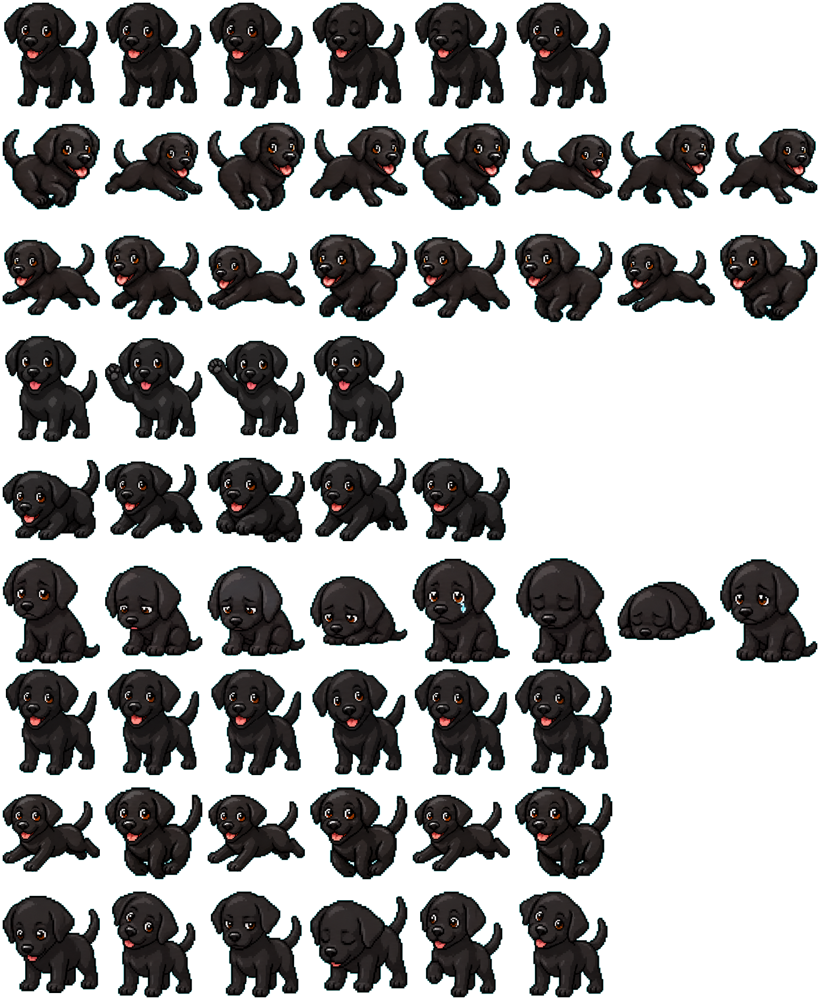

# Molly the Black Lab Codex pet

Molly is a black lab and a pet for the OpenAI Codex desktop app. Always ready to help or play with typical black lab energy.

## Installation

In the Codex desktop app, open the pet folder in the settings:

1. Open Codex settings.
2. Select Appearance. (It should be the second one down.)
3. Scroll all the way down to the Pets section, then to "Custom Pets"
4. Click "Open Folder." It also lists the folder you will be using.
5. Copy the `molly/` folder from this repo into the opened pets folder.
6. Go back to the Codex app, hit "Refresh", select "Molly" and hit "Wake Pet".
7. You should now have a little black lab on your screen to help you code.

## Sprite Sheet

